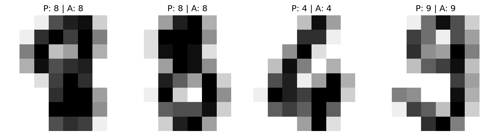
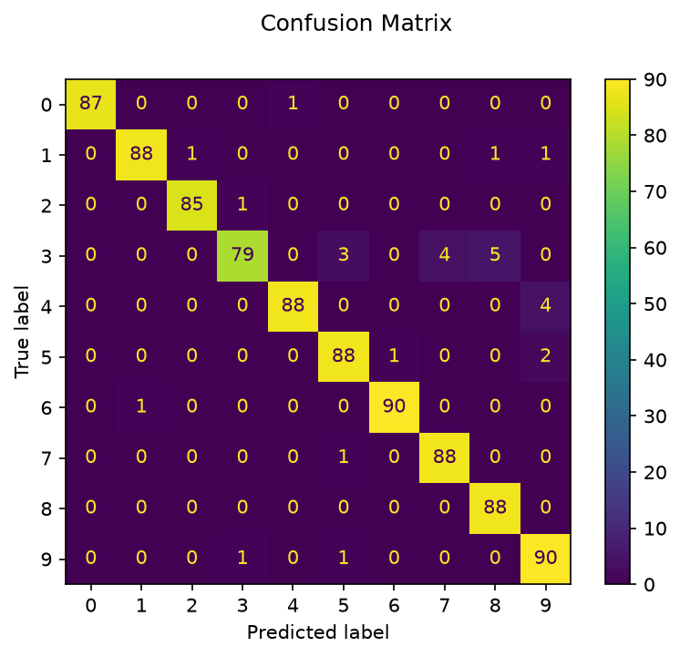

# scikit-learn baseline

This section implements handwritten digit classification using the built-in scikit-learn digits dataset and a Support Vector Classifier.

## Notebook

`digits_classification.ipynb`

## Workflow

```text
8 × 8 digit image
↓
64 numerical features
↓
train/test split
↓
Support Vector Classifier
↓
prediction
↓
evaluation
```

The notebook covers:

* dataset inspection
* digit visualization
* image flattening
* SVM training
* predictions
* precision, recall and F1-score
* confusion matrix
* multiclass classification evaluation

This serves as the classical machine-learning baseline for the later PyTorch implementations.

## Example outputs

These figures were captured by running the existing notebook cells. The notebook file itself is unchanged.

### Digit samples

Four labeled images from the built-in digits dataset.


### Predictions on test images

Each image shows the predicted label (`P`) and actual label (`A`).



### Confusion matrix

Rows show actual classes and columns show predicted classes for the notebook's test split.


