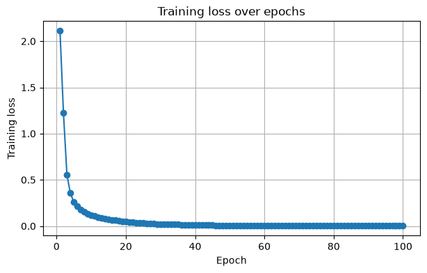
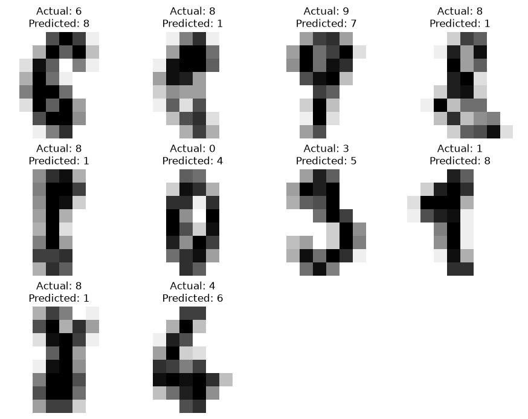

# PyTorch neural network

This section implements the same handwritten digit-classification problem using a small feed-forward neural network in PyTorch.

## Notebooks

* `digits_pytorch_cpu.ipynb`
* `digits_pytorch_gpu.ipynb`

Both notebooks use the same dataset and neural-network architecture so the CPU and GPU execution workflows can be compared directly.

## Model

```text
64 input features
↓
128 neurons
↓
ReLU
↓
64 neurons
↓
ReLU
↓
10 output classes
```

The notebooks introduce:

* PyTorch tensors
* TensorDataset and DataLoader
* neural-network layers
* ReLU activation
* cross-entropy loss
* Adam optimizer
* epochs and mini-batches
* forward propagation
* backpropagation
* model evaluation
* CPU and CUDA execution
* training-loss visualization
* confusion matrix
* misclassification analysis

The GPU notebook keeps the same model and moves the model and training batches to CUDA.

## Example outputs

These are some of the generated outputs from the [CPU](digits_pytorch_cpu.ipynb) and [GPU](digits_pytorch_gpu.ipynb) notebook.

### CPU training loss

Training loss decreases over the CPU notebook's 100 epochs.



### CPU confusion matrix

The saved CPU run achieved **98.06% test accuracy**, with 7 misclassifications among 360 test images.


### GPU misclassification examples

The saved GPU run misclassified 10 test images. Each example shows its actual and predicted labels.


