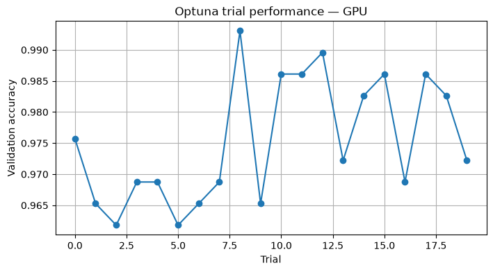
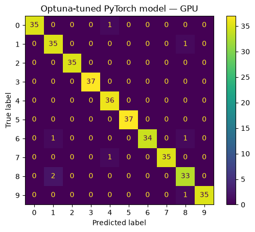
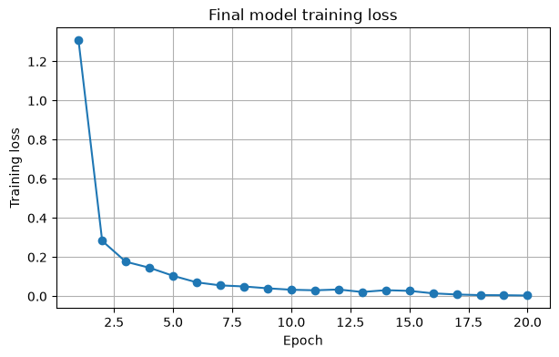
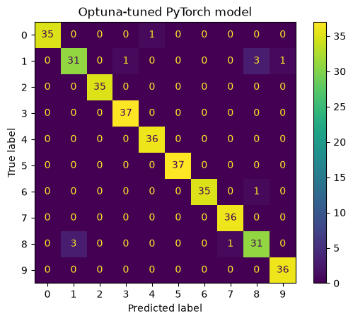
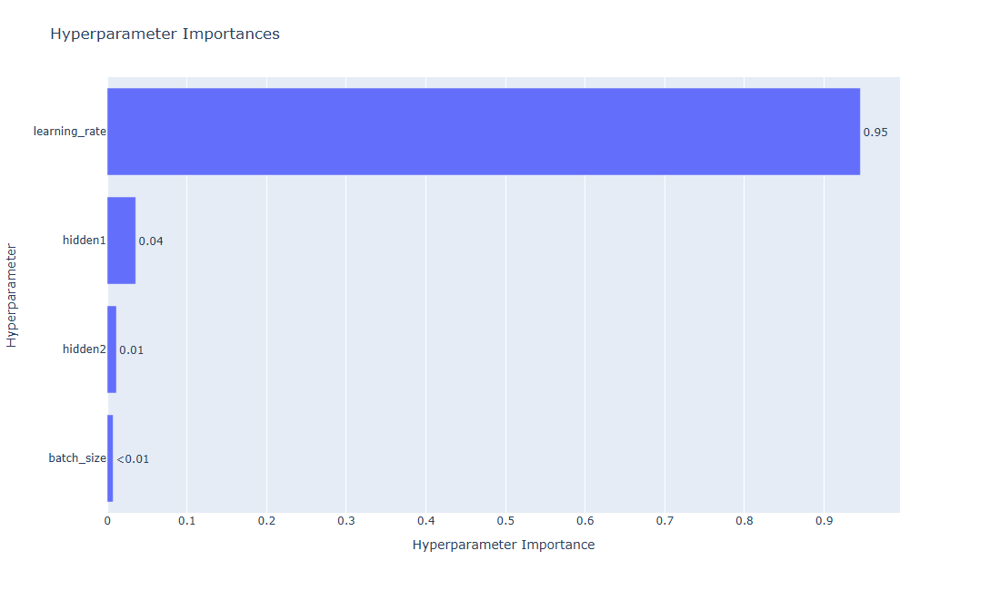
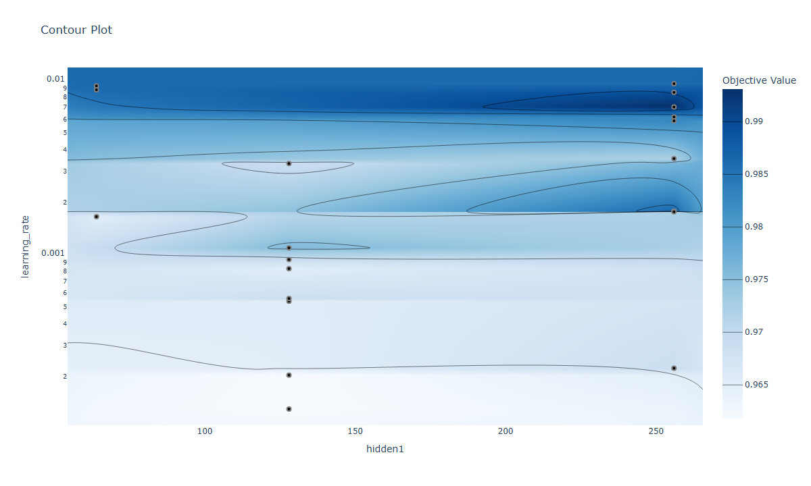

# PyTorch with Optuna

This section extends the PyTorch digit classifier with automated hyperparameter optimization using Optuna.

## Notebooks

* `digits_pytorch_optuna_cpu.ipynb`
* `digits_pytorch_optuna_gpu.ipynb`

## Hyperparameters

The Optuna study searches over:

* learning rate
* batch size
* first hidden-layer size
* second hidden-layer size

## Workflow

```text
training data
↓
Optuna trial
↓
select hyperparameters
↓
train PyTorch model
↓
validation accuracy
↓
repeat across trials
↓
best hyperparameters
↓
retrain final model
↓
evaluate on untouched test set
```

A separate validation set is used during tuning so that the final test set remains independent of hyperparameter selection.

The notebooks include:

* Optuna study creation
* configurable neural-network architecture
* multiple optimization trials
* validation-based model selection
* best-parameter reporting
* trial-performance visualization
* final model retraining
* test-set evaluation
* CPU and GPU implementations

In the GPU version, PyTorch performs model training on CUDA while Optuna manages the hyperparameter search.

## Example outputs

These images are exported directly from the saved [CPU](digits_pytorch_optuna_cpu.ipynb) and [GPU](digits_pytorch_optuna_gpu.ipynb) notebook outputs.

### GPU hyperparameter search

Each point represents a trial's learning rate and hidden-layer sizes. Color indicates validation accuracy.


### GPU validation accuracy across trials

The best validation accuracy in this saved 20-trial study was **99.31%**.



### GPU final test evaluation

After retraining with the selected hyperparameters, the saved GPU run achieved **97.78% test accuracy** on the untouched test set.



### CPU final training loss

After selecting the best hyperparameters, the CPU notebook retrains the model on the combined training and validation data for 20 epochs.



### CPU final test evaluation

The saved CPU run achieved **96.94% test accuracy**, with 11 misclassifications among 360 test images.



### GPU hyperparameter importance

Estimated importance of each hyperparameter in the saved GPU study.



### GPU learning-rate and hidden-layer contour

Validation accuracy across learning-rate and first hidden-layer-size combinations in the saved GPU study.


