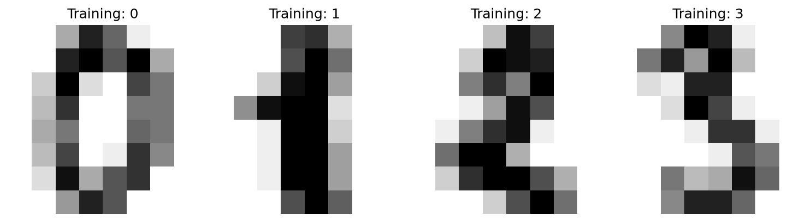
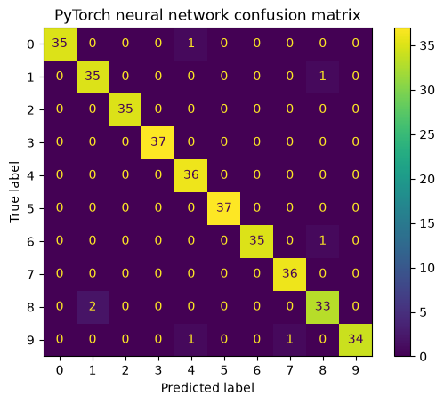
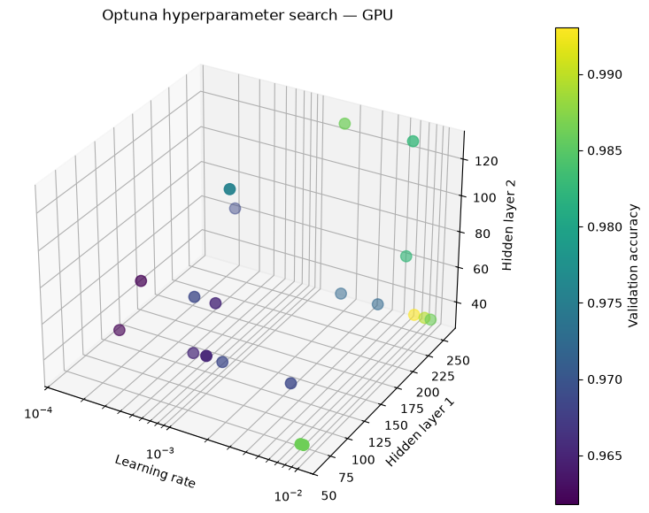

# Handwritten digit classification

A compact machine-learning project exploring handwritten digit classification using classical machine learning, neural networks, GPU execution, and hyperparameter optimization.

The project progresses through three implementations:

1. **scikit-learn** — Support Vector Machine baseline
2. **PyTorch** — feed-forward neural network on CPU and GPU
3. **PyTorch + Optuna** — hyperparameter tuning on CPU and GPU

The project uses the built-in scikit-learn digits dataset containing 1,797 grayscale handwritten digit images. Each image is `8 × 8` pixels and belongs to one of the classes `0–9`.

## Results at a glance

### Handwritten digit samples

Example images from the [scikit-learn baseline](01_scikit-learn/digits_classification.ipynb).



### Neural-network predictions

The saved [PyTorch CPU run](02_pytorch/digits_pytorch_cpu.ipynb) achieved **98.06% test accuracy** on 360 digits.



### Hyperparameter exploration

The saved [Optuna GPU run](03_pytorch_optuna/digits_pytorch_optuna_gpu.ipynb) explores learning rate and hidden-layer sizes; color indicates validation accuracy.



## Project structure

```text
ml-proj/
├── assets/
│   └── images/
│
├── README.md
├── requirements.txt
├── .gitignore
│
├── 01_scikit-learn/
│   ├── README.md
│   └── digits_classification.ipynb
│
├── 02_pytorch/
│   ├── README.md
│   ├── digits_pytorch_cpu.ipynb
│   └── digits_pytorch_gpu.ipynb
│
└── 03_pytorch_optuna/
    ├── README.md
    ├── digits_pytorch_optuna_cpu.ipynb
    └── digits_pytorch_optuna_gpu.ipynb
```

## What is covered

* loading and visualizing image data
* converting images into numerical features
* train/test splitting
* multiclass classification
* Support Vector Machines
* feed-forward neural networks
* PyTorch tensors and DataLoaders
* loss functions and optimizers
* forward and backward propagation
* CPU and GPU training
* accuracy, precision, recall and F1-score
* confusion matrices
* misclassification analysis
* hyperparameter optimization with Optuna

## Implementations

### 01 — scikit-learn

A classical machine-learning baseline using a Support Vector Classifier.

The notebook introduces the complete classification workflow while keeping the implementation simple and interpretable.

### 02 — PyTorch

The same digit-classification problem is implemented using a small feed-forward neural network.

Both CPU and GPU versions are included so the execution workflow can be compared while keeping the model architecture unchanged.

### 03 — PyTorch + Optuna

The PyTorch model is extended with automated hyperparameter optimization using Optuna.

The tuning process explores:

* learning rate
* batch size
* first hidden-layer size
* second hidden-layer size

CPU and GPU implementations are included.

## Setup

Create or activate a Python environment and install the project dependencies:

```bash
pip install -r requirements.txt
```

The notebooks can be opened using Jupyter Notebook, JupyterLab, or VS Code.

## GPU execution

The GPU notebooks require a CUDA-enabled PyTorch installation and a compatible NVIDIA GPU.

Install the appropriate PyTorch build for your system using the official PyTorch installation instructions.

The CPU notebooks do not require CUDA.

## Dataset

The project uses:

```python
from sklearn.datasets import load_digits
```

Dataset characteristics:

```text
Samples: 1797
Classes: 10
Image size: 8 × 8
Features per sample: 64
```

No external dataset download is required.

## Purpose

This repository is intended as a compact hands-on progression from classical machine learning to neural-network training and hyperparameter optimization using the same classification problem.
